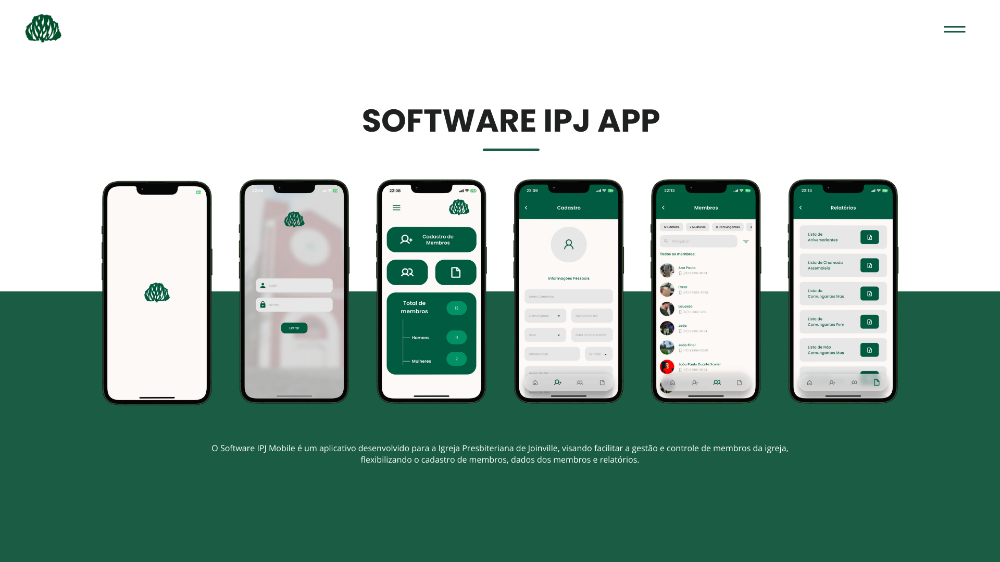

<p align="center">
  
</p>
<h3 align="center">Projeto Software IPJ</h3>
<h4 align="center"> PAC - Projeto de Aprendizagem Colaborativa Extensionista do Curso de Engenharia de Software da Católica de Santa Catarina</h4>
<p align="center">
  
</p>

### Autores 
* João Paulo Duarte Xavier
* Kalebe Fukuda de Oliveria


### Justificativa
O **PAC** (Projeto de Aprendizagem Colaborativa Extensionista) é uma iniciativa que visa criar uma aplicação para a gestão de membros e atividades dentro de uma **igreja** (ou entidade beneficente). O objetivo principal é fornecer uma solução tecnológica para organização de eventos, cadastros de membros, relatórios e comunicação interna, promovendo uma melhoria na gestão administrativa e nas atividades de engajamento da igreja com seus membros. A aplicação ajudará a simplificar a organização de eventos e relatórios, melhorando a eficiência da administração.

### Descrição do App
Este aplicativo foi desenvolvido como parte do PAC, visando atender às necessidades de gestão de uma instituição religiosa (igreja). As funcionalidades incluem o cadastro e a gestão de membros, criação de relatórios de presença, gerenciamento de sociedades internas, entre outros. O app permite o armazenamento e a manipulação de dados importantes, como informações de membros, eventos e estatísticas relacionadas às atividades da igreja.

### Apresentação do aplicativo 📱
#### **📄PDF**: [pdf aqui](./readme_docs/Software%20IPJ%20Mobile.pdf) 

#### **🎬 Vídeo**:

<a href="https://youtube.com/shorts/zUOCckeT1Sg?si=UtOZdZuNs8W_lNE9"></a>

#### **Jira**: [link do jira](https://joaoduartte.atlassian.net/jira/software/projects/PAC/boards/2)

#### **Confluence**: [link do confluence](https://joaoduartte.atlassian.net/wiki/spaces/DDS/overview) 


### Requisitos para preparar o ambiente de desenvolvimento❗️
Para rodar o projeto em sua máquina local, é necessário ter as seguintes ferramentas instaladas:

- **Flutter** (versão recomendada): 3.x ou superior.
- **Dart**: versão compatível com o Flutter.
- **IDE recomendada**: Visual Studio Code, IntelliJ ou Android Studio.
- **Clone o repositório do GitHub**:
   ```bash
   git clone https://github.com/kalebefukuda/SoftwareIPJ_app.git
   ```
- **Dependências do projeto**: As dependências podem ser instaladas executando o comando `flutter pub get`.
- **Supabase**: 
  - Criar uma conta no [Supabase](https://supabase.io)
  - Criar a tabela membros: 
        [Arquivo Txt](./readme_docs/supabaseTables.txt)
  - Criar um arquivo .env na raiz do projeto
  - Dentro do arquivo .env:
     ```bash
      SUPABASE_URL= <sua_url>
      SUPABASE_KEY= <sua_chave_anonima>
      ```
  - Executar o comando:
    ``` bash
      flutter run
    ```


## Licença

Esse projeto está sob a licença MIT.
